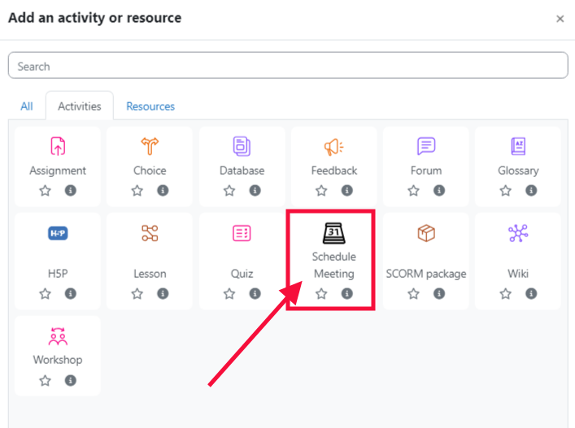
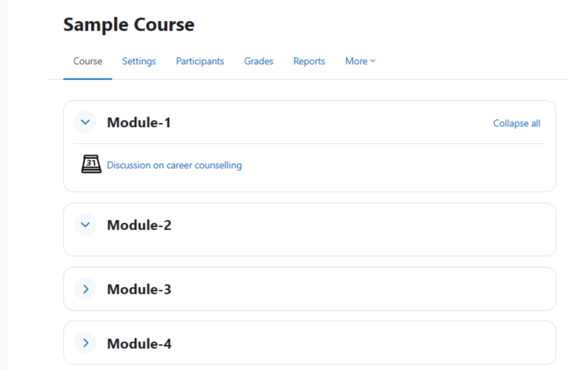
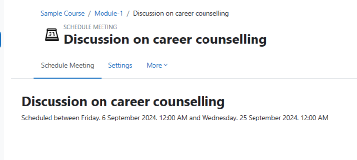

# Developed By
Rajesh Rafaliya  
For support, please reach out to [rajeshrafaliya@gmail.com](mailto:rajeshrafaliya@gmail.com)

_____________________________________________________________

# Schedule Meeting Activity Plugin

This Moodle activity plugin allows instructors to schedule meetings for specific course sections, set meeting titles, and define start and end dates for each meeting. Students can view and participate in scheduled meetings within the course timeline.

## Features
- Schedule meetings for specific course sections
- Define meeting title, start date, and end date
- Restrict student access based on start and end dates

## Installation
1. Download the plugin or clone the repository into your Moodle's `mod` directory:
   ```bash
   git clone https://github.com/rajeshrafaliya/schedulemeeting.git mod/schedulemeeting

_____________________________________________________________

_____________________________________________________________

_____________________________________________________________

_____________________________________________________________